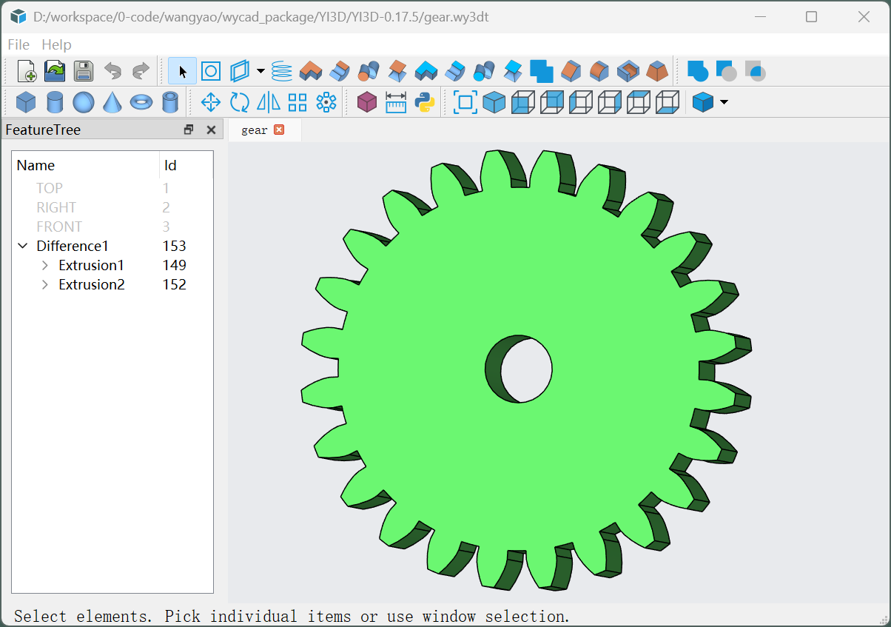

# Yi3D



Yi3D is a simple and easy-to-use **open-source** 3D modeling application, available on Windows and Linux.

 [wangyaosoft.com](https://www.wangyaosoft.com)

- **Sketch-based parametric modeling** — create extrusion, revolution, sweep, and loft features from 2D sketches.
- **Primitive-based Boolean modeling** — combine built-in shapes such as box, cylinder, and sphere with union, difference, and intersection operations.

## Features

- **Primitives**: Box, Cylinder, Sphere, Cone, Torus, Tube
- **Sketching**: Line, Circle, Arc, Ellipse, Ellipse Arc, Spline, Point, Centerline, Text
- **Part Modeling**: Extrusion, Revolution, Loft, Sweep, Helix
- **Boolean Operations**: Union, Difference, Intersection
- **Solid Modifications**: Fillet, Chamfer, Draft, Shell
- **Patterns**: Linear Pattern, Circular Pattern
- **Transformations**: Move, Rotate, Scale, Mirror
- **Datum Planes**: Coincident, Parallel, Perpendicular, Angular, Tangent, Three-Point
- **Python Scripting**: Full Python API for programmatic model creation and modification
- **AI-Assisted Modeling**: Natural-language-to-3D via integrated Claude Code skill
- **File Formats**: Binary `.wy3db` and text `.wy3dt` model files

## Architecture

```
Yi3D
├── src/wy3d/       Core modeling library (DLL) — OCCT-based parametric engine
├── src/wy3dApp/    Desktop application (EXE) — Qt 5 + OSG graphical interface
├── src/wy3dPY/     Python bindings (wy3d.pyd) — built with pybind11
├── inc/            Public C++ headers
├── scripts/        Python modeling script examples
├── samples/        Sample model files (.wy3db / .wy3dt)
├── 3rdParty/       Third-party dependencies and prebuilt bundles
├── doc/            Design documentation
└── skills/         Claude Code AI-assisted modeling skill
```

## Dependencies

| Dependency | Purpose |
|------------|---------|
| [OpenCASCADE (OCCT)](https://dev.opencascade.org/) | 3D geometry kernel |
| [Qt 5](https://www.qt.io/) | GUI framework |
| [OpenSceneGraph (OSG)](http://www.openscenegraph.org/) | 3D rendering engine |
| [WYAF](https://github.com/wangyao1052/WYAF) | Application framework (free for non-commercial use; commercial license required) |
| [Python 3.10](https://www.python.org/) | Scripting runtime |
| [pybind11](https://github.com/pybind/pybind11) | C++/Python bindings |
| [Google Test](https://github.com/google/googletest) | Unit testing framework |
| [muParser](https://beltoforion.de/en/muparser/) | Math expression parser |
| [FreeType](https://freetype.org/) | Font rendering |

## Building from Source

### Windows

- **Compiler**: MSVC 2019+, C++17

1. Clone the repo: `git clone https://github.com/wangyao1052/Yi3D.git`
2. Download `Yi3D-LibBundles-1.0.0.zip` from the [releases page](https://github.com/wangyao1052/Yi3D-LibBundles-Windows/releases/tag/v1.0.0) and extract into `Yi3D/3rdParty/bundles/`
3. Open the project folder in **Visual Studio** and build

> For detailed step-by-step instructions, see [Compiling with Visual Studio](doc/compiling-with-visual-studio.md) ([中文](doc/compiling-with-visual-studio-zh.md)).

### Linux

1. Download the WYAF framework from [WYAF](https://github.com/wangyao1052/WYAF) and extract it to `3rdParty/bundles/wyaf/`.
2. Install the remaining system packages (OCCT, Qt5, OSG, Python3, FreeType) via your package manager.
3. Build with CMake.

## Python Scripting

Create a box with a fillet using the `wy3d` module:

```python
import wy3d

db = wy3d.Database()

box = wy3d.Box()
box.setSize(100, 100, 100)
db.add(box)

fillet = wy3d.Fillet()
fillet.setBaseElement(box)
fillet.setRadius(10)
fillet.addEdge(...)  # select the edges to fillet
db.add(fillet)

db.saveAs("box_with_fillet.wy3db")
```

See the `scripts/` directory for more examples.

## AI-Assisted Modeling

Yi3D integrates a [Claude Code](https://claude.ai/code) skill for natural-language-to-3D workflows:

1. Describe the desired model in natural language
2. AI generates a Python modeling script
3. The script is sent to Yi3D for execution via TCP/IPC
4. Review the result and iterate

See `skills/YI3D/SKILL.md` for details.

## License

This project is open-sourced under the **Apache License, Version 2.0**.

See [LICENSE](LICENSE) for the full license text and [NOTICE.md](NOTICE.md) for third-party attributions.

```
Copyright (C) 2024-2026 Wang Yao <wangyao1052@163.com>

Licensed under the Apache License, Version 2.0 (the "License");
you may not use this file except in compliance with the License.
You may obtain a copy of the License at

    http://www.apache.org/licenses/LICENSE-2.0

Unless required by applicable law or agreed to in writing, software
distributed under the License is distributed on an "AS IS" BASIS,
WITHOUT WARRANTIES OR CONDITIONS OF ANY KIND, either express or implied.
See the License for the specific language governing permissions and
limitations under the License.
```

## Author

**Wang Yao** — <wangyao1052@163.com>
