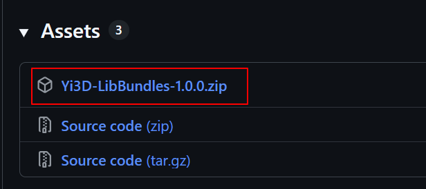

# Compiling Yi3D with Visual Studio

## Prerequisites

| Item | Requirement |
|------|-------------|
| **OS** | Windows 7 or later (64-bit) |
| **Visual Studio** | Visual Studio 2019 or 2022 or 2026 (Community / Professional / Enterprise) |
| **CMake** | 3.15 or later (the version bundled with Visual Studio is sufficient) |
| **Compiler** | MSVC v142 (VS 2019), v143 (VS 2022), or v145 (VS 2026), C++17 |

## Step 1: Get the Source Code

```bash
git clone https://github.com/wangyao1052/Yi3D.git
```

---

## Step 2: Download Dependencies

Download `Yi3D-LibBundles-1.0.1.zip` from [https://github.com/wangyao1052/Yi3D-LibBundles-Windows/releases/tag/v1.0.1](https://github.com/wangyao1052/Yi3D-LibBundles-Windows/releases/tag/v1.0.1), and extract into `Yi3D/3rdParty/bundles/`.



After extraction, the project directory should look like:

```
Yi3D
├── 3rdParty/
│   └── bundles/
│       ├── occt/
│       ├── osg/
│       ├── python3/
│       ├── qt5/
│       └── wyaf/
├── inc/
├── src/
├── CMakeLists.txt
├── CMakeSettings.json
└── ...
```

---

## Step 3: Open the Project in Visual Studio

1. Launch **Visual Studio**
2. Select **"Open a local folder"**
   - Or via menu: **File → Open → Folder...**
3. Choose the Yi3D **root directory** (the one containing `CMakeLists.txt`)

Visual Studio will automatically detect `CMakeSettings.json` and parse the configurations within it.

---

## Step 4: Configure and Build

Once the project is opened, Visual Studio automatically runs CMake generation. You can monitor progress in the Output window.

### Available Configurations

Two predefined configurations are provided (defined in `CMakeSettings.json`):

| Configuration | Description | Generator |
|---------------|-------------|-----------|
| **x64-Debug** | Debug build with symbols, no optimization | Ninja |
| **x64-Release** | Release build with optimization and PDB debug info | Ninja |

### Build

Select **Build → Build All** from the menu (or press `Ctrl+Shift+B`).

### Build Output

Build artifacts are placed in `out/<CMAKE_BUILD_TYPE>/`:

```
out/
├── Debug/
│   ├── YI3D.exe         ← main executable
│   ├── wy3d.dll
│   ├── wy3dPY.pyd
│   ├── unitTest.exe
│   ├── scripts/        (Python script examples)
│   ├── samples/        (Sample model files)
│   └── python3/        (Python runtime, auto-copied)
└── Release/
    ├── YI3D.exe         ← main executable
    ├── wy3d.dll
    └── ...
```

Intermediate CMake build files are placed under `out/build/<configuration>/`, which is ignored by git.

